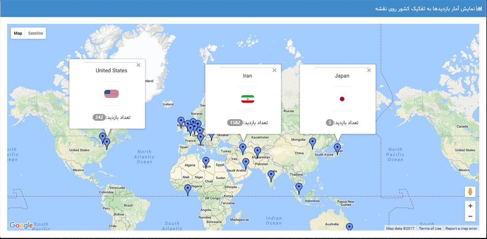
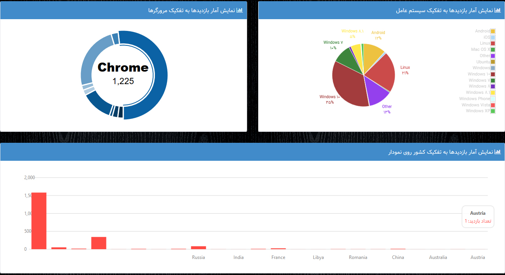

# WebSiteStatistics
Obtain detailed statistics of visits to sites 
 
## Asp.Net MVC 5 Application 
* Using SignalR to showing realtime online users with notification and playing sound for alert 
* visits Statistics by Country regions
* visits Statistics by browser usage 
* visits Statistics by country on google map
* visits Statistics by referer



  # پروژه بدست آوردن آمار کامل بازدید‌های یک وب سایت در ASP.NET MVC
  ## امکانات پروژه
* افراد آنلاین
* بازدید امروز
* بازدید کل از زمان راه اندازی پروژه
* بازدید یونیک
* درصد استفاده از مرورگرها
* درصد استفاده از سیستم عامل ها
* در آینده آمارهای بیشتری به پروژه افزوده خواهند شد.
