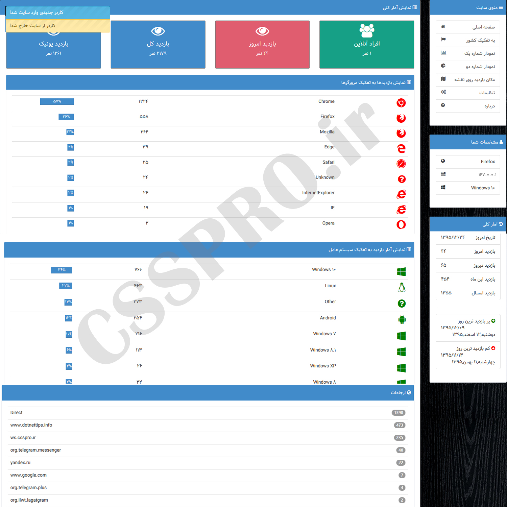

# WebSiteStatistics
Obtain detailed statistics of visits to sites  
 
Asp.Net MVC 5 Application  
Using SignalR to showing realtime online users with notification and playing sound for alert 
visits Statistics by Country regions 
visits Statistics by browser usage  
visits Statistics by country on google map 
visits Statistics by referer 
and ...

![WebSiteStatistics-Map] (images/Map.png)

![WebSiteStatistics-charts] (images/Chart.png)
